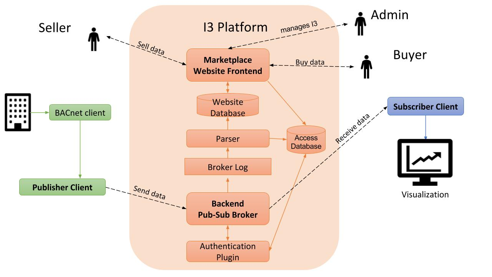

# I3 CORE

The I3 Marketplace is a real-time IoT data marketplace for smart communities. The I3 core repository holds application code for the market place services and GUI while [I3-SDK](https://github.com/ANRGUSC/I3-SDK) is the software developement kit that supports the client to subscribe and publish to the I3-Marketplace.

For more information on I3, please visit https://i3.usc.edu/

The I3 marketplace is implemented with a web-based marketplace frontend connected to a publish-subscribe broker backend. The website allows sellers to post streaming data products, buyers to purchase them, and then the broker allows the corresponding data river to flow from the authorized seller to the buyer. 

## Documentations

1. https://i3admin.readthedocs.io/en/latest/

2. https://i3user.readthedocs.io/en/latest/

## [front-end](https://github.com/ANRGUSC/iotm/tree/master/frontend)

The frontend of I3 is a marketplace built using [Django](https://www.djangoproject.com), a Python Web framework that is widely used for websites with large databases. I3 is also built upon the open source code by [Digital Marketplace](https://github.com/codingforentrepreneurs/digital-marketplace), which provided much of the structure and functionality for buying and selling digital products. Digital Marketplace is an implementation of Django.

## [back-end](https://github.com/ANRGUSC/iotm/tree/master/backend)

The backend uses [eclipse mosquitto](https://mosquitto.org), an implementation of [mqtt](http://mqtt.org) protocol, as the platform to broker messages between publishers and subscribers.

### [scripts](https://github.com/ANRGUSC/iotm/tree/master/scripts)

Scripts to be run at boot up.

## Contributors 
This I3 SDK has been initially developed by researchers at the [Center for Cyber-Physical Systems and the Internet of Things](http://cci.usc.edu/), Viterbi School of Engineering, University of Southern California. 
[To contribute to the project, please review the contribution guidelines](CONTRIBUTING.md).

## Code of Conduct
[Please refer the code of conduct to maintain a user and developer friendly environment](CODE_OF_CONDUCT.md)
