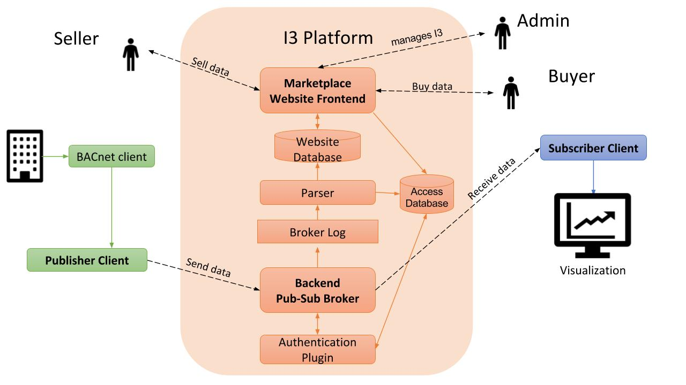

# I3 (Please update this file)

# Example running instance at 18.219.4.146:8000/1883

# For now please see the I3 v1 user guide by Xiangchen at http://18.219.4.146:8000/media/I3_v1_user_guide.pdf, a formal user documentation will be added later. For now, when starting the project, please go inside mysql running container, connect to mysql server and manually copy-paste backend/mqtt/mysql.sql. REST API and superuser fuctions are only partially supported. Product edit view is not restricted to product creator. Example MQTT pub/sub scripts can be found in gateway folder, example JWT generation script can be found in /backend/python_c_integrate/verify_jwt. Marketplace is running in python3, django2; server JWT verification and parser_agent are running in python2.




The I3 marketplace is implemented with a web-based marketplace frontend connected to a publish-subscribe broker backend. The website allows sellers to post streaming data products, buyers to purchase them, and then the broker allows the corresponding data river to flow from the authorized seller to the buyer. 

Adding text here for testing

## [front-end](https://github.com/ANRGUSC/iotm/tree/master/frontend)

The frontend of I3 is a marketplace built using [Django](https://www.djangoproject.com), a Python Web framework that is widely used for websites with large databases. I3 is also built upon the open source code by [Digital Marketplace](https://github.com/codingforentrepreneurs/digital-marketplace), which provided much of the structure and functionality for buying and selling digital products. Digital Marketplace is an implementation of Django.

## [back-end](https://github.com/ANRGUSC/iotm/tree/master/backend)

The backend uses [eclipse mosquitto](https://mosquitto.org), an implementation of [mqtt](http://mqtt.org) protocol, as the platform to broker messages between publishers and subscribers.

### [clients](https://github.com/ANRGUSC/iotm/tree/master/clients)

Sample publisher and subscriber code.

### [gateways/bacnet](https://github.com/ANRGUSC/iotm/tree/master/gateways/bacnet)

This is a publisher client that gets data from University of Southern California's BACnet network. It can be used by any other BACnet network. Many automated buildings employ BACnet equipment.

### [scripts](https://github.com/ANRGUSC/iotm/tree/master/scripts)

Scripts to be run at boot up.

# I3 Installation (Ubuntu / Mac)

Docker
----
The whole project can be run using docker. 
If you do not have docker installed please visit https://docs.docker.com/install/ and follow instructions for installions for your respective machine.

Run the ``i3_start.sh`` script that is placed under ``scripts``. This starts the **frontend**, **backend**, **parser agent**, **http to mqtt converter**, and **mysql** server. The script also makes a few changes to the started containers in order for the marketplace to successfully run. Please look at the ``i3_start.sh`` file in order to see the actual commands being run.

MySQL Light Troubleshooting
----
Case 1: Upon build, if ``django.db.utils.OperationalError: (1130, "Host '(Your IP Address)' is not allowed to connect to this MySQL server")`` is thrown, please follow the steps below:

Remove the existing mysql contiainer by running these commands:
```sh
$ docker kill mysql
$ docker rm -f mysql
```

Case 2: 
```sh
Starting mysql ... error

ERROR: for mysql  Cannot start service mysql: b'driver failed programming external connectivity on endpoint mysql (47c15280369b9e78c6a291047dcf77a9e24711447d4704a8c626c066cd9fb31f): Error starting userland proxy: listen tcp 0.0.0.0:(some port number): bind: address already in use'

ERROR: for mysql  Cannot start service mysql: b'driver failed programming external connectivity on endpoint mysql (47c15280369b9e78c6a291047dcf77a9e24711447d4704a8c626c066cd9fb31f): Error starting userland proxy: listen tcp 0.0.0.0:(some port number): bind: address already in use'
ERROR: Encountered errors while bringing up the project.
ERROR: No container found for django_1
Starting mysql ... error
....
```
This means that some application is already listen on the port specified. This could be due to previous i3 starts. To know which application is listening, run this command: 
``sudo netstat -plnt | grep ':(port number)'``

In the last column, it should say the name of the application running. Simply stop it with this command: 
``sudo systemctl stop PROGRAM_NAME``

Try running i3_start.sh again.

Case 3: (MAC) Upon build, if this is error comes up: ``Starting 7b18c081fda8_mysql ... error
ERROR: for 7b18c081fda8_mysql  Cannot start service mysql: b'driver failed programming external connectivity on endpoint 7b18c081fda8_mysql (0a6be91417b839ae095bd28bcf2e85c521f5fbe976bae0c2260448487f4eda3b): Error starting userland proxy: Bind for 0.0.0.0:3306 failed: port is already allocated'`` 

This means that MySQL is already running in the specified port in the error message. Need to kill the MySQL instance at that port. Run:
```sh
$ sudo lsof -i :(PORT NUMBER)
$ sudo kill -9 (PORT NUMBER) or sudo kill $(lsof -t -i :PORT NUMBER)
```


## Creating a Super User to Log-in I3 Website:

Now that you have I3 up and running, there is no default user and password. A super user must be created through the Django container. 

1. Enter the Django container shell:
```sh
$ docker exec -it iotm_django_1 /bin/bash
```
2. Run this python script:
```sh
python manage.py createsuperuser
```
3. Fill in the user details, and type exit on the terminal once the super user is created.
4. Try Logging in with the super user credentials you just creadted.

## MQTT ACL Table Creation:

Next, in order for the tables for the backend to be created a sql file needs to be run. 

1. Enter the mysql container shell:
```sh
$ docker exec -it mysql bash
```
2. Navigate to ```/var/log/mosquitto``` and change the permissions of mosquitto.log file.

```sh
$ cd /var/log/mosquitto
$ chmod 755 mosquitto.log
```
3. Then, run this mysql command: 
```sh
$ mysql -u anrg_iotm -pAnRg@UsC
```
4. Load the example user and acl tables in the database (database: iotm2):
```sh
mysql> use iotm2;
mysql> source mysql.sql;
mysql> exit
```

## Access the I3 marketplace website:
1. Open a web browser and type his url: ``localhost:8000``

2. Log-in with the super user credentials.

3. After looging in, you should see the Dashboard page. 

License
----

MIT

